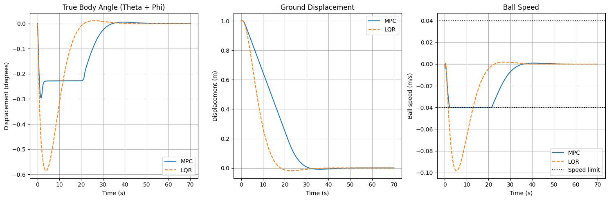
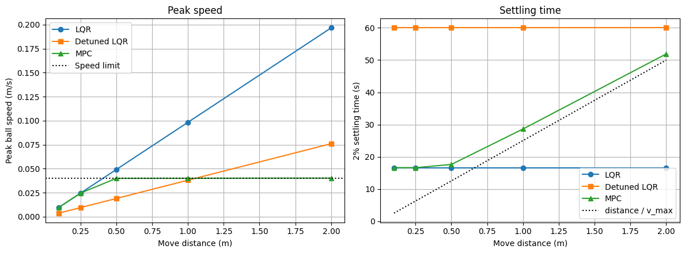
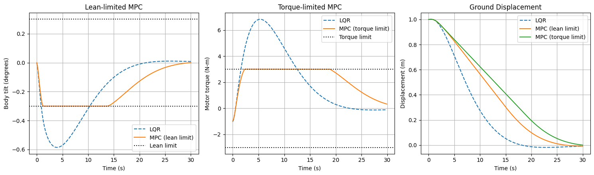

# CMU Ballbot: LQR vs MPC Comparison

For my linear multivariable controls project, I followed along with CMU's implementation of an LQR controller to their ballbot as practice and went on to control the system with MPC. However, what I didn't do then which I want to do now is explore why you would want to use MPC to control a system. Here, I explored the limits of LQR in comparison to MPC and see what MPC brings to the table that LQR doesn't.

**Notebooks:** `LQR_Implementation.ipynb` (model + LQR) · `MPC_implementation.ipynb` (MPC + experiments)

---

## 1. Model and LQR recap

The planar ballbot model (Lauwers et al., 2005) uses $`q = [\theta,\ \phi]^\top`$, where $`\theta`$ is the ball angle and $`\phi`$ is the body angle relative to the ball, so the absolute body tilt is $`\theta + \phi`$ and the ball position is $`r_b\theta`$. The Euler–Lagrange equations are

```math
M(q)\ddot q + C(q,\dot q) + G(q) + D(\dot q) = \begin{bmatrix} 0 \\ \tau \end{bmatrix}
```

An inner PI loop makes the ball velocity track a commanded velocity $`\omega_d`$, adding an integrator state $`x_5`$:

```math
\tau = k_p(\omega_d - \dot\theta) + k_i(x_5 - \theta), \qquad \dot x_5 = \omega_d
```

Linearizing about upright ($`x_a = 0`$), with $`\sin(\theta+\phi) \approx \theta+\phi`$ and $`M_* = M(0)`$:

```math
M_*\ddot q = m_B g \ell\,(\theta+\phi)\begin{bmatrix}1\\1\end{bmatrix} - \begin{bmatrix}\mu_\theta \dot\theta\\ \mu_\phi \dot\phi\end{bmatrix} + \begin{bmatrix}0\\ \tau\end{bmatrix},
\qquad
M_* = \begin{bmatrix} \Gamma_1 + 2 m_B r_b \ell & \Gamma_2 + m_B r_b \ell \\ \Gamma_2 + m_B r_b \ell & \Gamma_2 \end{bmatrix}
```

This gives $`\dot x_a = A x_a + B\,\omega_d`$ with $`x_a = [\theta,\ \phi,\ \dot\theta,\ \dot\phi,\ x_5]^\top`$. Note that the gravity and damping signs in the published $`A`$ matrix are flipped relative to this derivation, and $`M_*`$ requires the $`r_b`$ in its coupling terms to be positive definite. The corrected model has one unstable pole at $`+3.13`$ rad/s (the body falling over) and is fully controllable.

The model is discretized with a zero-order hold at $`\Delta t = 0.1`$ s, and LQR minimizes

```math
J = \sum_{t=0}^{\infty} \left( x_t^\top Q x_t + u_t^\top R u_t \right), \qquad Q = \mathrm{diag}(1,1,1,1,0),\quad R = 15
```

with the gain from the discrete algebraic Riccati equation:

```math
P = Q + A_d^\top P A_d - A_d^\top P B_d \left(R + B_d^\top P B_d\right)^{-1} B_d^\top P A_d,
\qquad
K = \left(R + B_d^\top P B_d\right)^{-1} B_d^\top P A_d,
\qquad u = -Kx
```


---

## 2. How MPC is implemented

At every time step $`k`$, MPC measures the state $`x(k)`$ and solves a finite-horizon constrained QP:

```math
\min_{x,\,u,\,s}\; \sum_{t=0}^{N-1} \left( x_t^\top Q x_t + u_t^\top R u_t + \rho\,\mathbf{1}^\top s_t + \rho\,\lVert s_t \rVert^2 \right) + x_N^\top P\, x_N
```

subject to

```math
x_0 = x(k), \qquad x_{t+1} = A_d x_t + B_d u_t, \qquad
\frac{\lvert \dot\theta_{t+1} \rvert}{v_{\max}} \le 1 + s_{t,1}, \qquad
\frac{\lvert \theta_{t+1} + \phi_{t+1} \rvert}{\alpha_{\max}} \le 1 + s_{t,2}, \qquad
\frac{\lvert \tau_t \rvert}{\tau_{\max}} \le 1 + s_{t,3}, \qquad s_t \ge 0
```

Only the first input $`u_0^*`$ is applied, then the problem is re-solved from the new state (receding horizon). Key design choices:

- **Horizon:** $`N = 20`$ steps (2 s), with the same $`Q`$, $`R`$ and plant as the LQR design.
- **Terminal cost $`P`$:** because $`x_N^\top P x_N`$ is the exact infinite-horizon LQR cost-to-go, MPC reduces to LQR whenever no constraint is active.
- **Soft constraints:** each constraint is normalized by its limit, so a slack $`s = 0.01`$ means 1% over for every constraint. With the linear penalty weight $`\rho`$ larger than the constraint's Lagrange multiplier, the soft constraint behaves exactly like a hard one, but the problem can never become infeasible. Here $`\rho = 10^4`$.
- **Torque constraint:** through the PI loop, $`\tau_t = k_p(u_t - \dot\theta_t) + k_i(x_{5,t} - \theta_t)`$ is linear in $`(x, u)`$, so a motor torque limit is just one more linear inequality.

---

## 3. Main run: 1 m move with a 0.04 m/s speed limit



| | Peak ball speed | 2% settling time |
|---|---|---|
| LQR | 0.098 m/s (2.4× the limit) | 16.6 s |
| MPC | 0.040 m/s | 28.6 s |

MPC accelerates to the limit, cruises there, and brakes. During the cruise the body holds a constant $`-0.23^\circ`$ lean. That is the lean needed for gravity to balance ball–ground friction at constant speed, and it matches the steady-state prediction from the linear model:

```math
\alpha = \frac{\mu_\theta}{m_B g \ell}\,\dot\theta = 0.228^\circ
```

---

## 4. Experiment 1: MPC equals LQR when constraints are inactive

For a 0.25 m move, LQR peaks at 0.025 m/s, which never reaches the limit. With terminal cost $`P`$ and no active constraint, the MPC problem is the LQR problem, so the two closed-loop trajectories should be identical.

**Result:** $`\max_t \lVert x_t^{\mathrm{MPC}} - x_t^{\mathrm{LQR}} \rVert_\infty = 2.6 \times 10^{-9}`$ rad, i.e. solver round-off. This verifies the MPC implementation against an independent method before any comparison is trusted.

---

## 5. Experiment 2: why not just detune LQR?

Any linear controller satisfies $`x_t = (A_d - B_d K)^t x_0`$, so scaling the initial error by $`d`$ scales every signal by $`d`$:

```math
x_0 \to d\,x_0 \quad\Longrightarrow\quad x_t \to d\,x_t
```

Peak speed grows linearly with move distance, and settling time is identical for every distance. To test whether tuning can fix this, $`R`$ was increased until LQR respected the limit on the 1 m move ($`R = 384`$), and all three controllers were run over a range of distances.



| Move | LQR peak | LQR $`t_s`$ | Detuned peak | Detuned $`t_s`$ | MPC peak | MPC $`t_s`$ |
|---|---|---|---|---|---|---|
| 0.10 m | 0.010 | 16.6 s | 0.004 | 60.0 s | 0.010 | 16.6 s |
| 0.25 m | 0.025 | 16.6 s | 0.010 | 60.0 s | 0.025 | 16.6 s |
| 0.50 m | 0.049 ✗ | 16.6 s | 0.019 | 60.0 s | 0.040 | 17.6 s |
| 1.00 m | 0.098 ✗ | 16.6 s | 0.038 | 60.0 s | 0.040 | 28.6 s |
| 2.00 m | 0.197 ✗ | 16.6 s | 0.076 ✗ | 60.0 s | 0.040 | 51.9 s |

Speeds in m/s; limit 0.040 m/s.

- **LQR** breaks the limit for any move longer than about 0.41 m.
- **Detuned LQR** is 3.6× slower on every move, including small ones that never needed restraint, and it *still* breaks the limit at 2 m. Detuning only moves the failure point.
- **MPC** is identical to LQR below the limit, rides the limit above it, and its settling time tracks the physical minimum $`d / v_{\max}`$.

The underlying reason is that every linear gain is homogeneous, $`\kappa(\alpha x) = \alpha\,\kappa(x)`$. The constrained-optimal controller is not: it is piecewise affine, equal to LQR where no constraint binds and different where one does. No linear gain can reproduce it, and MPC computes it implicitly by solving the QP online.

---

## 6. Experiment 3: lean and motor torque limits

The speed limit is removed and two other limits are tested on the 1 m move, one at a time:

- **Lean** $`\lvert\theta + \phi\rvert \le 0.3^\circ`$. Lean is the unstable, unactuated direction, so it can only be limited by planning ahead through the dynamics.
- **Motor torque** $`\lvert\tau\rvert \le 3`$ N·m. This is a mixed state–input constraint, which clipping $`\omega_d`$ cannot enforce.

Both limits are illustrative values chosen to be active on this move, not hardware specifications.



| | Peak lean | Peak torque | Settling time |
|---|---|---|---|
| LQR | 0.585° | 6.83 N·m | 16.6 s |
| MPC, lean-limited | 0.300° | n/a | 24.1 s |
| MPC, torque-limited | n/a | 3.004 N·m | 27.3 s |

Each limit also caps the steady cruise speed. At constant speed ($`\dot\theta + \dot\phi = 0`$, $`\ddot q = 0`$), the linearized equations give

```math
m_B g \ell\,\alpha = \mu_\theta\,\dot\theta, \qquad \lvert\tau\rvert = (\mu_\theta + \mu_\phi)\,\lvert\dot\theta\rvert
```

so a lean limit and a torque limit each imply a maximum cruise speed:

| Limit | Predicted cruise speed | Simulated cruise speed |
|---|---|---|
| Lean ≤ 0.3° | 0.0526 m/s | 0.0525 m/s |
| Torque ≤ 3 N·m | 0.0431 m/s | 0.0432 m/s |

This is why the torque-limited run is the slower of the two. Speed, lean and torque limits are three views of the same steady-state balance against friction; they differ only in the transients.

---

## References

Lauwers, T., Kantor, G., & Hollis, R. (2005). *One is enough!* [Conference paper]. 12th International Symposium on Robotics Research, San Francisco, CA, United States. https://www.ri.cmu.edu/pub_files/pub4/lauwers_tom_2005_1/lauwers_tom_2005_1.pdf

Nagarajan, U., Kantor, G., & Hollis, R. L. (2014). The ballbot: An omnidirectional balancing mobile robot. *The International Journal of Robotics Research, 33*(6), 917–930. https://doi.org/10.1177/0278364913509126
